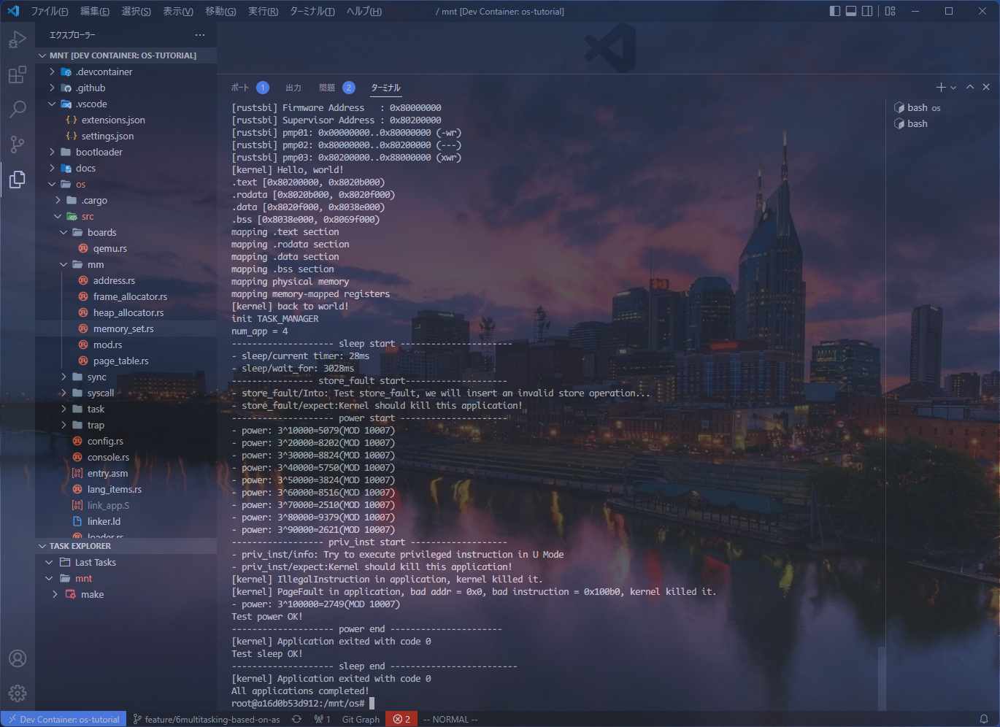

# rCore-Tutorial-Book-v3 3.6.0-alpha.1

RISC-V OS written in Rust

- Architecture: RISC-V RV64

## Feature

- [x] Batch Processing System

- [x] Cooperative Multitask

- [x] Timesharing Multitask

- [x] Page table

- [] Process

- [] File System

- [] InterProcess Communication and I/O Redirection

- [] Concurrency

- [] I/O Device Management

